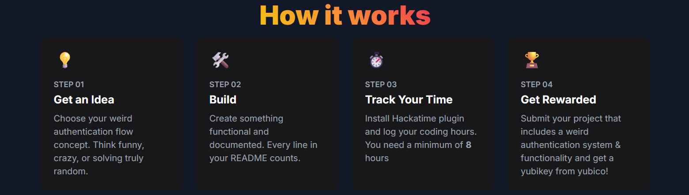

---

# Authly

Authly is a [You Ship We Ship](https://ysws.hackclub.com) program that rewards teenagers for creating unique and
interesting authentication systems with yubikeys, programmable NFC tags, and antivirus software giftcards.

## 🎯 The Challenge

Create an original authentication flow that is not frontend only, it actually saves and uses accounts.
This authentication flow should be unique and it can be as wacky as you want, as long as it is not a simple login form.
If your submission is approved, you'll receive a yubikey to enhance your security!

## 🌐 Resources

- Website: https://authly.hackclub.com
- Slack Channel: [#authly](https://hackclub.slack.com/archives/C0963JU3CSD)

## 📝 Submission Requirements

View requirements

1. **Self-Written**: Your program must be self-written and should not use any plug & play framework such as Firebase,
   Supabase, Clerk etc
2. **Unique Authentication Flow**: The authentication flow should be unique and not a simple login form. It can be as
   creative as you want, but it should not be frontend only.
   It **cannot** be a simple login form, it should be something that is not commonly seen in other authentication flows.
3. **Originality**: It must not be a remake of an existing authentication flow or someone else's.
4. **Open Source**: Your code must be open source and available on GitHub.
5. **Documentation**: Your code must be well documented and easy to understand. You should also be able to explain your
   code and the authentication flow in detail.
6. **Fully Functional**: Your app must work for multiple users - not just a demo for one person. No frontend-only stuff.
   Real users, real accounts. It’s okay to use simple session/cookie tools (like Flask or Express sessions).
7. **Coding Time Tracking**:  You must track all your coding time using Hackatime. A minimum of 6-10 hours of logged
   development time is required for your submission to be eligible.

## 📝 How to Submit
**Step 1** -> Use our [submission form](https://airtable.com/appLMKxJKjiqcNlSg/pagXLkgh6iPYS2hpD/form)

**Step 2** -> Make a PR so your project shows up in the submission gallery

## 🚀 How it works

## 🎁 Reward

If your submission is approved, you'll be eligible to recieve a yubikey, programmable NFC tags, and antivirus software giftcards (based on the hours you spend)

## 💡 Project Ideas

Here are some ideas to get you started:

- Log in by solving a riddle
- Authenticate with dance moves and pose detection
- Log in using your Minecraft server stats
- Build in a vulnerability and show how to hack it to log in
- Log in by clicking the right cat gif
- Authentication via AI that decides if you're you based on your writing tone

Remember: The more original and creative your project is, the better! These are just starting points - feel free to come
up with your own unique ideas!

## 🤝 Need Help?

Join the [#authly](https://hackclub.slack.com/archives/authly) channel on the Hack Club Slack to:

- Get help with your project
- Share your progress
- Connect with other participants
- Ask questions about the program

## Blog!
Check out the [blog](https://authly.hackclub.com/blog) for more information about the program, tutorials, and more!  
It also will have important announcements and updates about the program.

## Track our progress
You, as a participant, can track **our** progress on reviewing **your** projects [here!](https://authly.hackclub.com/track/)

## Tech-Stack

Simple static website with:

- html
- css
- tailwindCSS
- js (scrolling & particles)

## Demo

You can view a demo project for a weird authentication
system [here](https://github.com/jimmydin7/auth-ysws/tree/main/demo)

It's a habit tracker with a weird auth system. When a user signs up he enters a secret number and then to login he has
to solve an equation with his secret number as x, so this way only he knows the answer.
The app will be live soon!

Here is the live demo: [Demo]( https://jimdiet.pythonanywhere.com/)

## Contributors

  
View Contributors

  <ul>
    <li><a href="https://github.com/jimmydin7">jimmydin7</a> (main page + tutorials JSON + demo + intro animation)</li>
    <li><a href="https://github.com/Spacexplorer11">Spacexplorer11</a> (A lot - check commits for more info)</li>
    <li><a href="https://github.com/twonfi">twonfi</a> (small typo)</li>
    <li><a href="https://github.com/yehorscode">yehorscode</a> (logo variations)</li>
  </ul>

---

> Built with ❤️ by **Jim Dinias**  
> Mentored by POC, **Kate Caulfield**  
> Helped by **Akaalroop Singh** (Spacexplorer11)  
